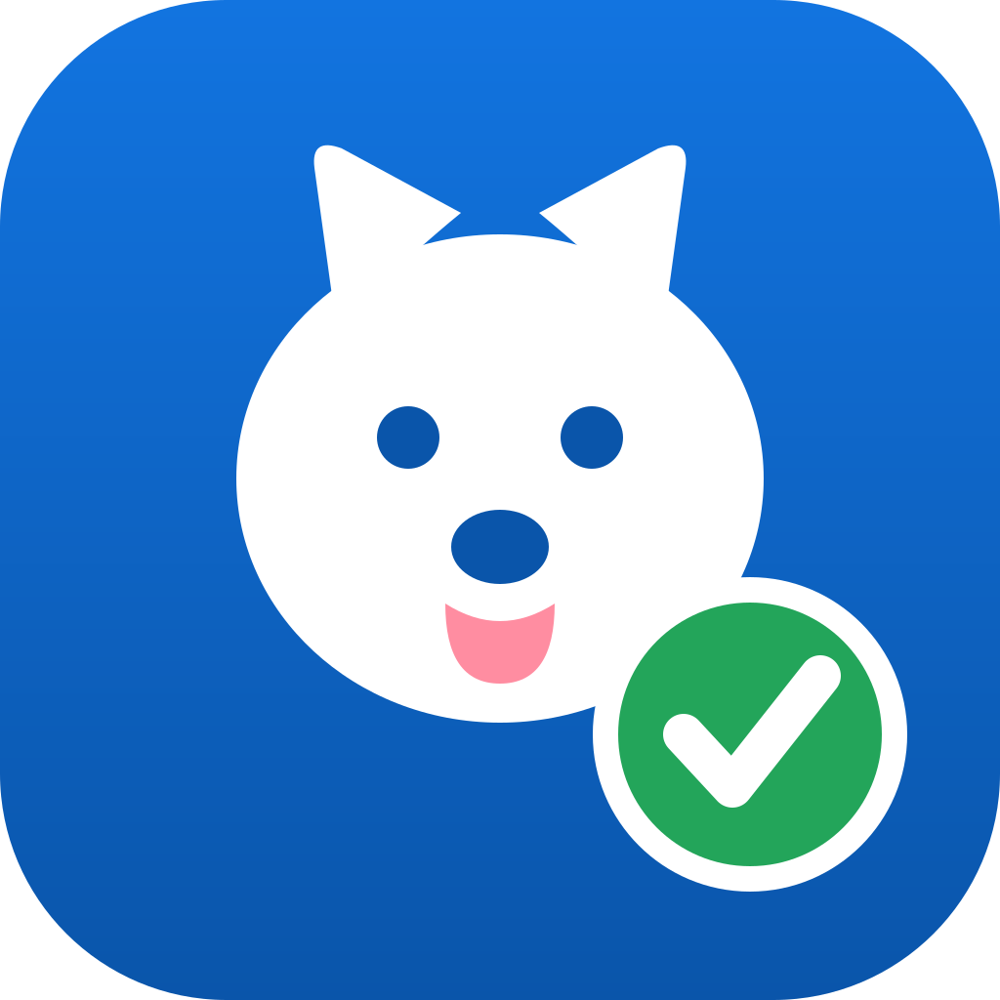

<div align="center">
  
  <h1>中标狗</h1>
  <p><strong>把招标文件交给 AI Agent，从读标、拆解、撰写到 Word 出件，一套流程完成。</strong></p>
  <p>面向投标团队的桌面标书助手 · macOS / Windows</p>

  [](https://github.com/shandianT/bid-dog/releases/tag/desktop-v0.11.0)
  [](https://github.com/shandianT/bid-dog/releases/download/desktop-v0.11.0/bid-dog_0.11.0_aarch64.dmg)
  [](https://github.com/shandianT/bid-dog/releases/download/desktop-v0.11.0/bid-dog_0.11.0_x64-setup.exe)
  
</div>

## 中标狗是什么？

中标狗是一款 AI Agent 驱动的标书生成桌面应用。上传招标文件后，它会按照真实投标工作的顺序完成预检、需求分析、评分项梳理、废标风险检查、任务拆分、分章撰写、逐条响应、汇总成册和出件检查，并把过程、问题与产物集中在一个任务工作台中。

它不是“一句话盲目生成整本标书”的写作工具。中标狗会在关键节点向你提问，对缺失资料明确标记，并把投标人名称、报价、资质、签章等高风险内容留给人工确认。

> 本仓库是中标狗的公开产品展示与安装包发布页，不包含产品源代码。中标狗是闭源软件，版权所有。

## 适合谁用？

- 经常参与政府、企业采购项目的投标团队
- 需要同时处理多个标书任务的售前和项目人员
- 希望复用公司资质、案例、产品资料和历史标书的团队
- 想把 Claude Code、Codex CLI 或现有 Agent 接入投标流程的用户

## 核心能力

| 能力 | 中标狗能做什么 |
|---|---|
| 招标文件理解 | 支持导入 PDF、DOCX、Markdown，梳理组成、格式和评分要求 |
| 12 阶段 Agent 流程 | 从素材体检、评分废标到分章撰写、汇总和 Word 门禁 |
| 风险体检 | 用红、黄、绿三档展示必须处理、建议确认和已通过事项 |
| 素材库 | 本地管理公司资料、资质案例、图片与章节模板；历史标书可自动拆章入库 |
| 人机协作 | Agent 在关键节点提问，用户可对话、补充文件、暂停或重跑任务 |
| 多引擎接入 | 支持 Claude Code、Codex CLI、自定义命令及 OpenAI 兼容模型网关 |
| 本地工作区 | 任务、产物、配置和素材默认保存在本机，素材库也可切换到共享盘 |
| 多平台桌面端 | 提供 macOS Apple Silicon 与 Windows x64 安装包 |

## 工作流程

```text
上传招标文件
    ↓
体检素材 → 解析要求 → 提取评分/废标项 → 拆解任务
    ↓
分章撰写 → 逐条应答 → 汇总成册 → 配图复核
    ↓
自检体检 → Word 格式门禁 → 人工确认 → 交付
```

## 下载

当前版本：**v0.11.0（预发布版）**

| 系统 | 下载 | 适用环境 |
|---|---|---|
| macOS | [下载 Apple Silicon 版 DMG](https://github.com/shandianT/bid-dog/releases/download/desktop-v0.11.0/bid-dog_0.11.0_aarch64.dmg) | M1 / M2 / M3 / M4 系列 Mac |
| Windows | [下载 Windows x64 安装程序](https://github.com/shandianT/bid-dog/releases/download/desktop-v0.11.0/bid-dog_0.11.0_x64-setup.exe) | Windows 10 / 11 64 位 |

安装包暂未进行商业代码签名。macOS 若提示“已损坏”，请按 [Mac 安装说明](docs/Mac安装说明.md) 放行；Windows SmartScreen 提示时选择“更多信息 → 仍要运行”。

## 使用前置条件

| 用途 | 需要准备 | 不需要 |
|---|---|---|
| 体验界面和 12 阶段流程 | 支持的电脑、最新版中标狗 | 不需要 Python、Node.js、API Key 或 CLI |
| 用 Claude Code 生成真实标书 | 安装并登录 `claude` CLI；可访问相应模型服务 | 技能包已内置，不需要单独安装 Python |
| 用 Codex 生成真实标书 | 安装并登录 `codex` CLI；可访问相应模型服务 | 技能包已内置，不需要单独安装 Python |
| 用自定义 Agent 生成 | 可在本机运行、符合参数约定的 Agent 命令 | 不限定模型厂商 |
| 连接 OpenAI 兼容网关 | Base URL、API Key 和模型名称 | 不是体验演示流程的必要条件 |

真实项目还应提前准备公司介绍、产品资料、资质证照、项目案例、图片和历史标书，并安排投标负责人进行最终审核。

## 三分钟开始使用

1. 安装并打开中标狗，等待左下角显示“本地引擎 · 已连接”。
2. 打开“设置 → 模型接入 → 生成引擎”。
3. 体验流程选择“内置演示流程”；真实生成选择已安装并登录的 Claude Code、Codex CLI，或配置自定义命令。
4. 把招标文件拖入窗口，按 Agent 的问题补充材料。
5. 下载 Word、Markdown 和自检报告，完成最终人工审核。

## 数据与安全

- 任务、交付物和配置默认保存在本机“文稿/中标狗”（Windows 为“文档/中标狗”）。
- 素材库默认在本机，也可以在应用内改到团队共享盘。
- API Key 保存在本机配置中，不要发送到聊天群或公开 Issue。
- 接入外部模型或 CLI 时，数据处理还受相应服务商条款约束。
- 涉密材料请先确认组织的数据安全要求。
- AI 产物必须人工复核，尤其是报价、资质、技术偏离、承诺和签章内容。

## v0.11.0 亮点

- 产品正式更名为“中标狗”，启用新图标和数据目录。
- 自动迁移旧版“标书助手”数据。
- 修复任务删除、重跑和素材清空操作。
- 自动查找 Homebrew、npm 等位置中的 Claude/Codex CLI。
- 错误提示增加自助入口，任务按状态分组。
- 素材库可切换到共享盘，并支持恢复默认位置。

完整记录见 [更新日志](CHANGELOG.md)。

## 文档

- [产品介绍](docs/产品介绍.md)
- [使用指南](docs/使用指南.md)
- [常见问题](docs/常见问题.md)
- [Mac 安装说明](docs/Mac安装说明.md)

## 重要说明

中标狗用于辅助分析和撰写，不保证中标，也不能代替投标负责人、法务或专业人员的最终审核。请始终以招标文件原文和正式澄清文件为准。

## 反馈

遇到问题或有功能建议，欢迎提交 [Issue](https://github.com/shandianT/bid-dog/issues)。请勿上传 API Key、客户机密、证件、报价或完整涉密标书。

---

<div align="center">中标狗 · 让投标团队把时间留给判断，而不是重复整理。</div>
