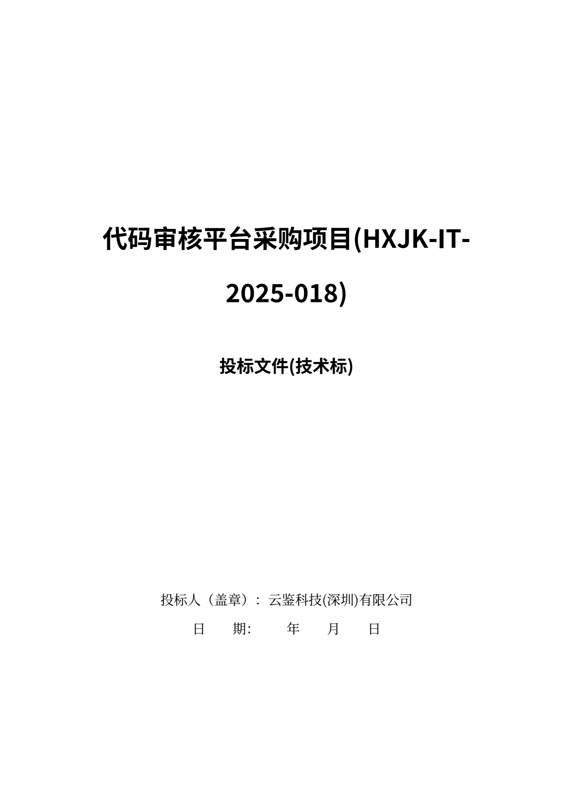
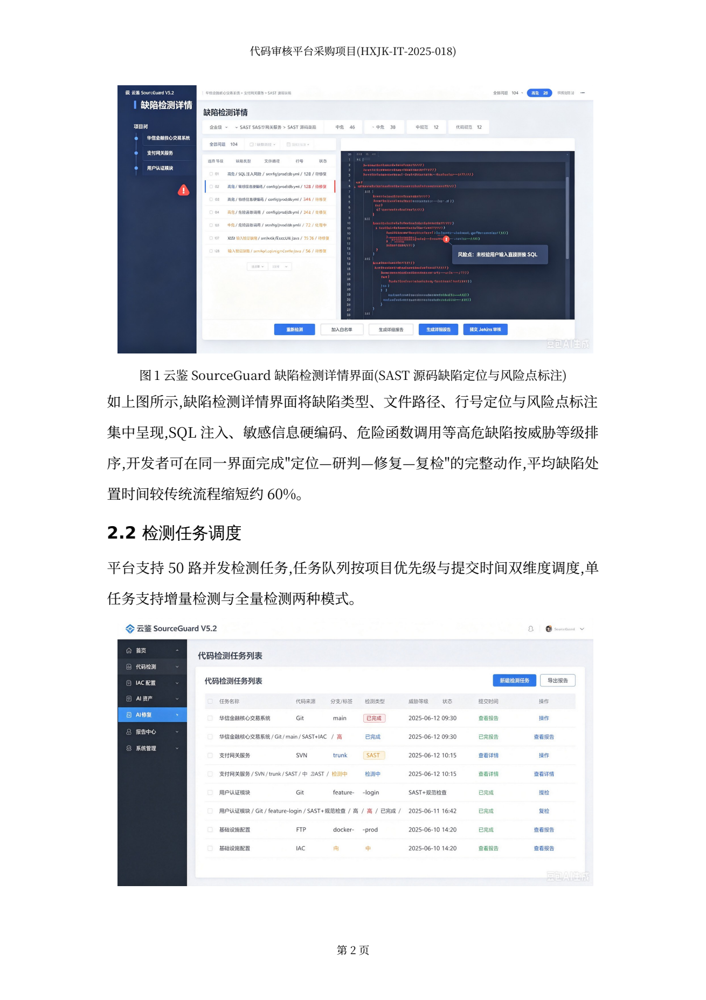
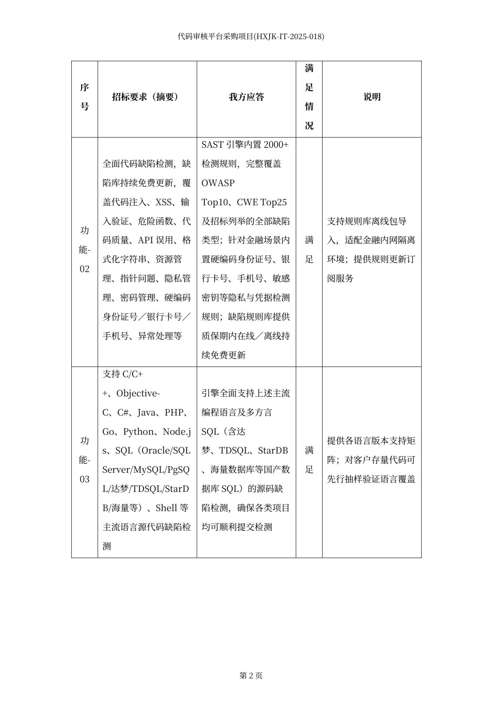
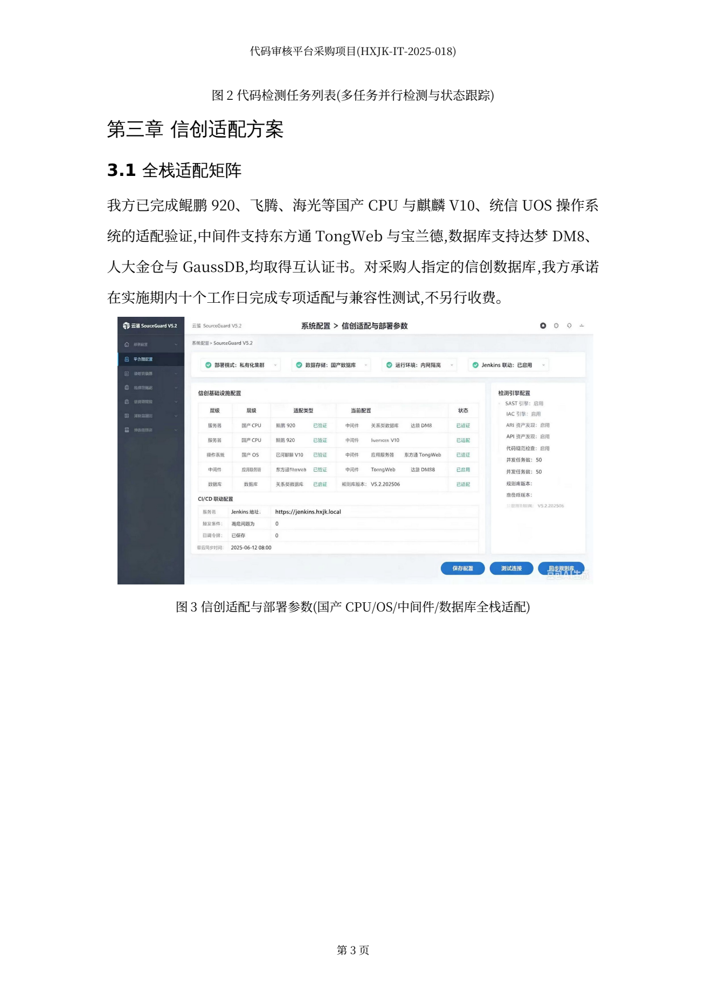

# 中标狗（bid-dog）

**这是什么** — 装在自己电脑上的桌面应用，macOS / Windows 都能装，文件不上传。放进一份招标文件，拆出评分点和废标项，分章写完正文和偏离表应答，出一份能直接交的 Word 标书。
**给谁用** — 拿到 Key 的同事和客户：装上、粘 Key、拖文件，不用注册 AI 账号。写代码的看文末架构小节。
**怎么开始** — 到 [Releases](https://github.com/shandianT/bid-dog/releases/latest) 下载 dmg / exe → 打开后粘一串 Key、选一个模式 → 把招标文件拖进窗口。

[](https://github.com/shandianT/bid-dog/releases/latest)
[](https://github.com/shandianT/bid-dog/actions/workflows/build.yml)


**官网**

https://bid-dog.vercel.app

**在线体验**

https://bid-dog.vercel.app/demo.html?demo=1

不用安装即可体验。

---

## 出来的 Word 长这样

四张都是成品 docx 直接渲染的页面。

<table>
<tr>
<td width="50%" valign="top">

<p><b>封面页</b> —— 项目名称、文件性质、投标人落款一次到位，黑体居中版式。<br>
封面、目录、页眉页脚、分节页码都不用再排一遍。</p>
</td>
<td width="50%" valign="top">

<p><b>图文正文页</b> —— 产品截图插在对应章节，图注连续编号，正文首行缩进两字符，页眉带项目名。<br>
图片按素材库《图片索引》的落位锚点插进对应位置。</p>
</td>
</tr>
<tr>
<td width="50%" valign="top">

<p><b>技术应答偏离表</b> —— 招标要求 → 我方应答 → 满足情况 → 说明，逐条对上，表头跨页重复。<br>
应答覆盖率会逐条核。</p>
</td>
<td width="50%" valign="top">

<p><b>章节图文页</b> —— 标题层级清楚，内容是成段的实质论述而不是要点罗列，配图落在它该在的那一章。<br>
篇幅和图位都过了质检。</p>
</td>
</tr>
</table>

---

## 下载

**[前往 Releases 下载最新版](https://github.com/shandianT/bid-dog/releases/latest)**

| 系统 | 安装包 | 说明 |
|---|---|---|
| macOS | [`bid-dog_0.17.6_aarch64.dmg`](https://github.com/shandianT/bid-dog/releases/download/desktop-v0.17.6/bid-dog_0.17.6_aarch64.dmg) | Apple Silicon（M 系列） |
| Windows | [`bid-dog_0.17.6_x64-setup.exe`](https://github.com/shandianT/bid-dog/releases/download/desktop-v0.17.6/bid-dog_0.17.6_x64-setup.exe) | Windows 10 / 11 64 位 |

安装包目前未做商业代码签名，两个系统各有一次放行动作，做完就再也不会提示：

- **macOS** 若提示“已损坏，无法打开”：把应用拖进「应用程序」后，终端执行
  ```bash
  xattr -cr /Applications/中标狗.app
  ```
  也可以在「系统设置 → 隐私与安全性」里点「仍要打开」。
- **Windows** 若弹出 SmartScreen 蓝色提示：点「更多信息」→「仍要运行」。

---

## 三步上手

1. **装** —— 双击安装包打开，等左下角显示「本地引擎 · 已连接」。引擎和执行外壳都已经打进安装包里了。
2. **粘 Key、选模式** —— 打开「设置 · 模型接入」，把发给你的 Key 粘进快速接入卡，选**标准**（写正式标书）或**极速**（试跑更快、更省额度），点一键接入。生成、对话、识图三件事一次全配好，四步实时打勾，配完当场测通。
3. **拖招标文件** —— 把招标文件（PDF / DOCX / Markdown）拖进窗口任意位置，按向导确认一下哪份是招标文件，点开始。跑的过程中可以随时提要求、补材料、暂停或重跑。

向导里的「你的要求」**预填了一份投标方案专家提示词**（小标题必须每章现拟、逐条应答招标条款、不编造、资质整块留位给人粘贴），改两句就能用，也可以整段换掉。这段会存进任务目录的《你的要求.md》，agent 开工先读，自检报告里逐条回执。

不用注册账号、不用登录 AI 服务、不用装 Node.js 和 Python、不用开终端。不填配置也能先跑一遍内置演示。

跑的时候对话区有一块「它正在做什么」，逐行显示读了哪个文件、跑了什么脚本、写出什么产物、字数够不够。旁边按本机历史耗时估预计等待时间，跑完折叠成回放。

---

## 质检不过就不出 Word

每一册出 Word 之前都要过一遍质检。查出来的问题不是提示你去改，是自动改完、用改好的稿子重出一版 Word，附一份《成品质检报告》说明改了什么、还差什么。

| 查什么 | 结果 |
|---|---|
| **图片落位** | 放错章节的图搬回去，漏配的补上，模型编出来的图剔掉。资质/合同/证照类只留粘贴位，不自动插——插错一张就是造假风险。 |
| **查重** | 同一段话换个说法反复写、逐字打散的碎片，折叠合并。 |
| **篇幅** | 按章核字数，太薄的标出来。 |
| **应答覆盖率** | 拿偏离表逐条对评分点，漏答的列清单。 |
| **Word 格式** | 字体、页边距、页码、表格列宽等三十多项挨个核，宽表转横排、表头跨页重复。 |

还有三条：

- **没出 Word 不算跑完。** 模型偶尔会把正文写完就收工、不执行最后一步导出。这种时候引擎自己把 Word 出出来——确定性脚本、不重跑、不花额度；实在出不来就直说「跑完了，但没有生成最终 Word」，而不是报一句「完成」让你自己去找。
- **不编造。** 素材库（公司资料、资质案例、图片索引）是唯一事实来源。资质、案例、报价缺了就标〔需补充〕，进补料清单。
- **不替你签字。** 投标人名称、报价、资质有效期、承诺与签章都留给人确认，出件前检查里的红色项不处理就不让出件。

---

## 花谁的额度

看你用的是哪条路：

| 你用的 | 花谁的额度 | 什么时候用 |
|---|---|---|
| **发给你的那串 Key**（标准 / 极速两种模式） | 发放方的 token 套餐 | 默认路径。不用注册、不用登录，装完粘上就能产真实标书 |
| **你自己的 Claude Code / Codex CLI 订阅** | 你自己的订阅 | 你本来就有订阅，想用自己的模型跑 |
| 本机已登录的 SoWork | 你本机那个账号 | 公司内部已经铺了 SoWork |

用发给你的 Key 时不消耗你自己的订阅额度，也不动你本机原有的 CLI 登录态和配置：它用的是应用数据目录里另一套独立配置。

Key 只存在本机的引擎配置里，页面不回显；执行外壳拿到的是一串本机随机口令，真 Key 只在引擎进程内用。任务文件、产物、素材都在「文稿/中标狗」，删掉应用文件还在。

---

## 给技术读者：架构

```
Tauri 壳(Rust + Web)  ──拉起/守护──▶  本地引擎(FastAPI, PyInstaller 单文件 sidecar, 127.0.0.1)
      ▲                                        │
      └────────── SSE 事件流(阶段/产出/台词/进度) ┘
                                               │
                                     执行外壳(随包分发) ──▶ 技能包(流程 + 确定性出件脚本)
```

- **桌面壳**：Tauri v2。负责窗口、拖拽、拉起并守护引擎、调系统默认应用直接打开产物。
- **本地引擎 sidecar**：FastAPI 用 PyInstaller 打成单文件二进制随安装包分发，客户机上没有 Python 也能跑；协议翻译、任务编排、质检调度都在这一层。
- **事件流**：任务状态由引擎按 SSE 推，前端只渲染。事件流是 async 生成器，不占死线程；页面重新可见时补一次同步再重挂流，后台标签被挂起也不假死。
- **技能包**：招投标流程 + 出件脚本（建 Word、格式核验、成品质检）。质检是确定性脚本、零 token，不依赖模型自觉——模型没跑，引擎也会在完成后补审计并按需重出 Word。

目录：`app/` 桌面壳 · `server/` 本地引擎 · `site/` 官网 · `docs/` 文档。构建见 [BUILD.md](BUILD.md)。

**源码可读，版权保留。** 本仓库公开代码供阅读、评估与问题复现；著作权归作者所有，未经许可请勿用于商业分发、再发布或衍生产品。

---

## 文档与反馈

- [使用与绑定指南](docs/使用与绑定指南.md) —— 接入、模式选择、日常排查、端口与证书问题
- [发 Key 接入方案](docs/让别人用S2模型.md) —— 面向发放方：Key 怎么发、安全边界、故障对照表
- [Mac 安装说明](docs/Mac安装说明.md) —— 提示「已损坏」时怎么放行
- [构建说明](BUILD.md) —— 自己出 dmg / exe
- [更新日志](CHANGELOG.md) —— 每版做了什么

遇到问题或有建议，欢迎提 [Issue](https://github.com/shandianT/bid-dog/issues)：请附系统版本、中标狗版本、现象和复现步骤；**请勿附带 API Key、客户机密或完整涉密标书**。

中标狗只做辅助分析与撰写，不保证中标，也代替不了投标负责人、法务和专业人员的最终审核。以招标文件原文和正式澄清文件为准。

---

作者：FDE-家涛