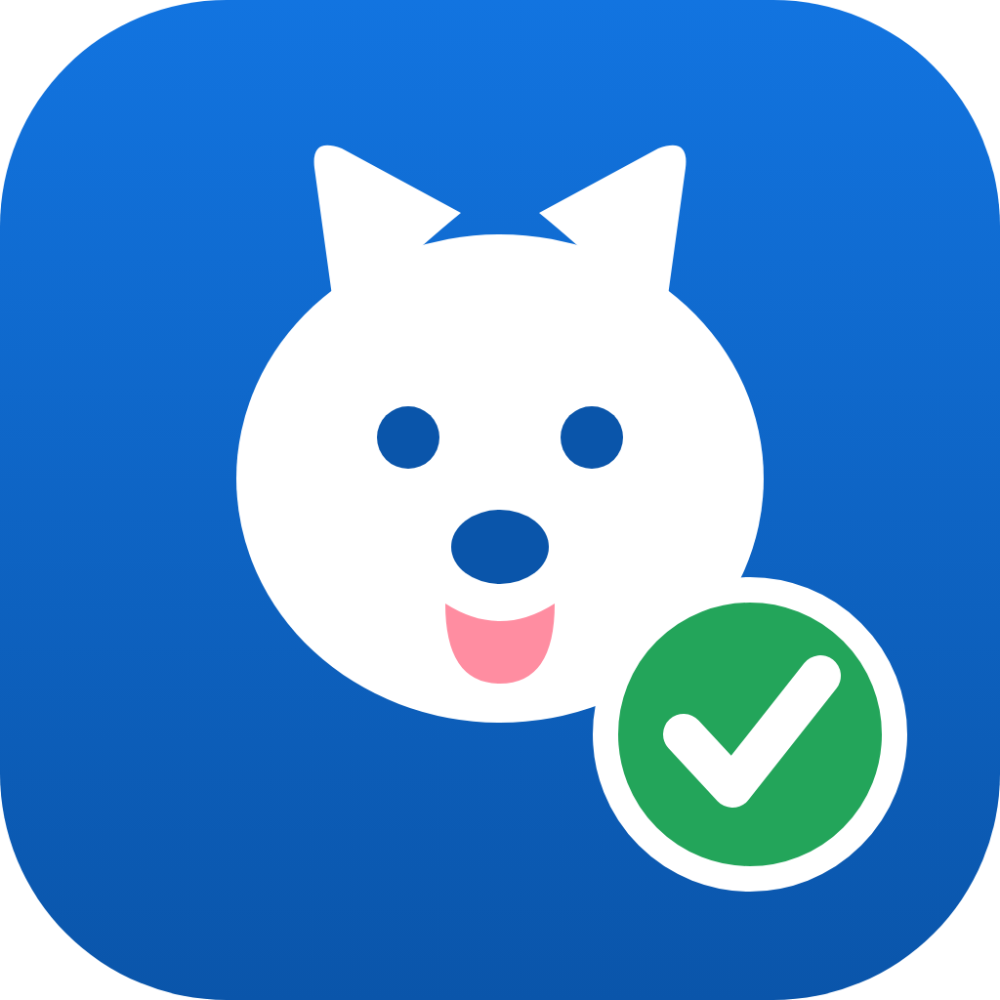

<div align="center">
  
  <h1>中标狗</h1>
  <p><strong>把招标文件交给 AI Agent，从读标、拆解、撰写到 Word 出件，一套流程完成。</strong></p>
  <p>面向投标团队的本地桌面标书助手 · macOS / Windows</p>

  [](https://github.com/shandianT/bid-dog/releases/tag/desktop-v0.12.1)
  [](https://github.com/shandianT/bid-dog/actions/workflows/build.yml)
  [](https://github.com/shandianT/bid-dog/releases/download/desktop-v0.12.1/bid-dog_0.12.1_aarch64.dmg)
  [](https://github.com/shandianT/bid-dog/releases/download/desktop-v0.12.1/bid-dog_0.12.1_x64-setup.exe)
</div>

## 中标狗是什么？

中标狗是一款 AI Agent 驱动的标书生成桌面应用。上传招标文件后，它会按照真实投标工作的顺序完成预检、需求分析、评分项梳理、废标风险检查、任务拆分、分章撰写、逐条响应、汇总成册和出件检查，并把过程、问题与产物集中在一个任务工作台中。

它不是“输入一句话，盲目生成整本标书”的写作工具。中标狗会在关键节点向你提问，对缺失资料明确标记，并把投标人名称、报价、资质、签章等高风险内容留给人工确认。

## 适合谁用？

- 经常参与政府、企业采购项目的投标团队
- 需要同时处理多个标书任务的售前与项目人员
- 希望复用公司资质、案例、产品资料和历史标书的团队
- 想把 Claude Code、Codex CLI 或自有模型接入投标流程的用户

## 核心能力

| 能力 | 中标狗能做什么 |
|---|---|
| 招标文件理解 | 支持导入 PDF、DOCX、Markdown，梳理组成、格式和评分要求 |
| 12 阶段 Agent 流程 | 从素材体检、评分废标到分章撰写、汇总和 Word 门禁 |
| 风险体检 | 用红、黄、绿三档展示必须处理、建议确认和已通过事项 |
| 素材库 | 本地管理公司资料、资质案例、图片与章节模板；历史标书可自动拆章入库 |
| 人机协作 | Agent 在关键节点提问，用户可继续对话、补充文件、暂停或重跑任务 |
| 多引擎接入 | 支持 S2 模型（填我们发的 Key 即用，走我们的 token 套餐）、SoWork、Claude Code、Codex CLI、自定义命令及 OpenAI 兼容模型网关 |
| 本地工作区 | 任务、产物、配置和素材默认保存在本机，也可把素材库切换到共享盘 |
| 多平台桌面端 | 提供 macOS Apple Silicon 与 Windows x64 安装包 |

## 工作流程

```text
上传招标文件
    ↓
体检素材 → 解析要求 → 提取评分/废标项 → 拆解任务
    ↓
分章撰写 → 逐条应答 → 汇总成册 → 配图复核
    ↓
自检体检 → Word 格式门禁 → 人工确认 → 交付
```

1. 上传招标文件，新建一个任务。
2. 根据 Agent 提示补充公司材料、参考标书或关键答案。
3. 在右侧工作台查看进度、材料和阶段产物。
4. 在出件前检查中处理红色风险项。
5. 直接打开生成的 Word、Markdown 与自检报告，人工复核后提交。

## 下载与安装

当前版本：**v0.12.1（预发布版）**

| 系统 | 下载 | 说明 |
|---|---|---|
| macOS | [下载 Apple Silicon 版 DMG](https://github.com/shandianT/bid-dog/releases/download/desktop-v0.12.1/bid-dog_0.12.1_aarch64.dmg) | 适用于 M1 / M2 / M3 / M4 系列 Mac |
| Windows | [下载 Windows x64 安装程序](https://github.com/shandianT/bid-dog/releases/download/desktop-v0.12.1/bid-dog_0.12.1_x64-setup.exe) | Windows 10 / 11 64 位 |
| 源码 | [下载完整源码本地运行版](https://github.com/shandianT/bid-dog/releases/download/desktop-v0.12.1/%E4%B8%AD%E6%A0%87%E7%8B%97_v0.12.1_%E6%BA%90%E7%A0%81%E6%9C%AC%E5%9C%B0%E8%BF%90%E8%A1%8C%E7%89%88.zip) | 解压后使用根目录的一键启动脚本 |

安装包暂未进行商业代码签名。macOS 若提示“已损坏”，请按 [Mac 安装说明](docs/Mac安装说明.md) 放行；Windows SmartScreen 提示时选择“更多信息 → 仍要运行”。也可以前往 [全部 Releases](https://github.com/shandianT/bid-dog/releases) 查看历史版本。

## 使用前置条件

先根据用途确认需要准备什么：

| 用途 | 必须准备 | 不需要 |
|---|---|---|
| 体验界面和 12 阶段流程 | 支持的电脑、最新版中标狗安装包 | 不需要 Python、Node.js、API Key 或 CLI |
| **用 S2 模型生成真实标书（推荐给同事/客户）** | 我们发的 API Key（执行外壳已内置在安装包里） | 不需要 Claude/Codex 账号、不需要 Node、不消耗任何订阅额度，详见[让别人用S2模型](docs/让别人用S2模型.md) |
| 用 Claude Code 生成真实标书 | 安装并登录 `claude` CLI；可访问相应模型服务 | 标书技能包已内置，不需要单独安装 Python |
| 用 Codex 生成真实标书 | 安装并登录 `codex` CLI；可访问相应模型服务 | 标书技能包已内置，不需要单独安装 Python |
| 用自定义 Agent 生成 | 一条可在本机运行的 Agent 命令，并能接收招标文件、输出目录和素材库路径 | 不限定具体模型厂商 |
| 连接 OpenAI 兼容网关 | 可用的 Base URL、API Key 和模型名称 | 不是体验演示流程的必要条件 |

此外，真实项目建议提前准备公司介绍、产品资料、资质证照、项目案例、图片和历史标书，并安排投标负责人进行最终审核。

支持的桌面环境：

- macOS Apple Silicon（M1 / M2 / M3 / M4）
- Windows 10 / 11 x64
- 安装和调用在线模型时需要网络连接
- Intel Mac 暂无现成安装包

开发者从源码构建才需要 Node.js、Rust 和 Python，普通安装用户不需要安装这些开发环境。

## 三分钟开始使用

1. 安装并打开中标狗，等待左下角显示“本地引擎 · 已连接”。
2. 打开“设置 → 模型接入 → 生成引擎”。
3. 只体验流程可选“内置演示流程”；拿了我们 Key 的用户选“S2 模型”粘贴 Key 即可；也可选择已安装并登录的 SoWork、Claude Code、Codex CLI，或配置自定义命令。标书技能包已内置。
4. 把招标文件拖入窗口，按 Agent 的问题补充材料。
5. 在任务产物中直接打开生成结果，并完成最终人工审核。

详细配置见 [使用与绑定指南](docs/使用与绑定指南.md)。

## 数据与安全

- 任务文件、交付物和配置默认保存在 `文稿/中标狗`（Windows 为“文档/中标狗”）。
- 素材库默认在本机，也可以在应用内改到团队共享盘；更换位置不会自动搬迁原文件。
- API Key 保存在本机配置中，不应上传到仓库或发送到聊天群。
- 接入外部模型或 CLI 时，数据处理还受相应服务商条款约束；涉密材料请先确认组织的数据安全要求。
- AI 产物必须人工复核，尤其是投标人信息、报价、资质有效期、承诺和签章内容。

## v0.12.1 亮点

- 新增「S2 模型 · 用我们发的 Key」生成引擎：接收方无需任何账号或登录，填一串 Key 即产真实标书，额度走我们的 token 套餐。
- **执行外壳（Codex 二进制）已内置到安装包**：客户不装 Node、不跑命令，开箱即用；源码本地运行包提供「一键安装」按钮（npmmirror 镜像优先，带进度，损坏自愈）。
- 引擎内置 Responses↔chat 协议中转，Codex 直连自有 S2 网关；不改用户原有 `~/.codex`，真 Key 不出引擎进程。
- 「测试连接」分层报错（Key/网关/模型/外壳/中转层），每条都是中文下一步动作。
- 定制发包支持 `preset_config.json` 预置配置：给某家客户的专版可以连 Key 都预填好（公开包严禁携带）。

完整版本记录见 [CHANGELOG](CHANGELOG.md)。

## 文档

- [产品介绍](docs/产品介绍.md) — 定位、场景、价值和能力边界
- [使用与绑定指南](docs/使用与绑定指南.md) — 模型、CLI 与生成引擎配置
- [让别人用S2模型](docs/让别人用S2模型.md) — 发 Key 给同事/客户接入我们 API 的完整方案
- [常见问题](docs/常见问题.md) — 安装、连接、生成和数据问题
- [Mac 安装说明](docs/Mac安装说明.md) — Gatekeeper 放行方法
- [开发与构建](BUILD.md) — 本地运行和安装包构建

## 项目结构

```text
app/        Tauri v2 桌面应用
server/     本地 FastAPI 引擎与任务协议
docs/       产品与使用文档
deploy/     本地及云端部署材料
design/     界面设计参考
```

## 开发

```bash
# 启动本地引擎与 Web 界面
python3 server/engine_v1.py

# 启动桌面开发环境
cd app
npm install
npm run dev
```

开发环境、安装包和签名配置详见 [BUILD.md](BUILD.md)。

## 重要说明

中标狗用于辅助分析和撰写，不保证中标，也不能代替投标负责人、法务或专业人员的最终审核。请以招标文件原文和正式澄清文件为准，并在提交前检查全部实质性响应项。

## 反馈

遇到问题或有功能建议，欢迎提交 [Issue](https://github.com/shandianT/bid-dog/issues)。反馈时请说明系统版本、中标狗版本、问题现象和复现步骤；请勿附带 API Key、客户机密或完整涉密标书。

---

<div align="center">中标狗 · 让投标团队把时间留给判断，而不是重复整理。</div>
