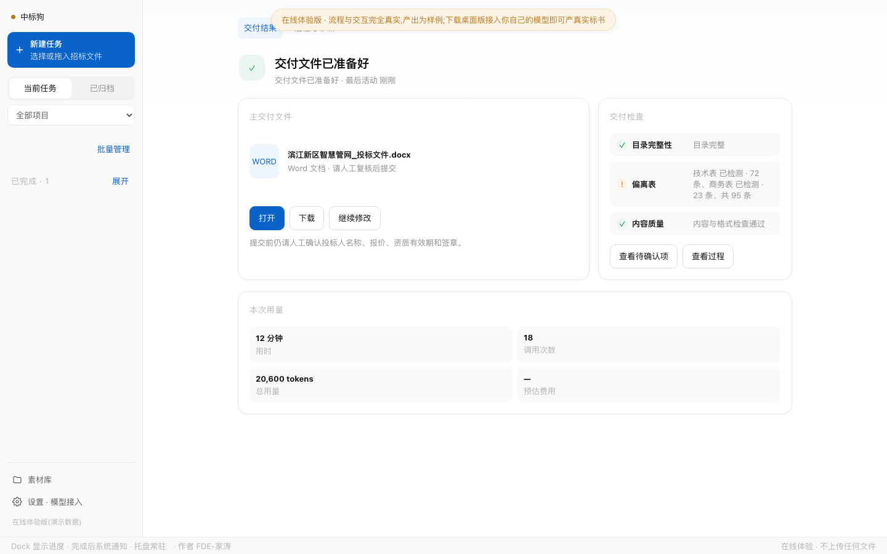

# 中标狗：把招标文件变成可检查、可继续修改的 Word 标书

> 上传招标文件，自动拆解评分点和废标风险，生成正文、偏离表与可编辑 Word，并在交付前完成格式和内容检查。

**适用平台：** macOS Apple Silicon（M 系列）｜Windows 10 / 11 x64  
**当前版本：** v0.20.1
**下载：** [官网](https://bid-dog.vercel.app)｜[GitHub Releases](https://github.com/shandianT/bid-dog/releases/latest)｜[在线体验](https://bid-dog.vercel.app/demo.html?demo=1)

## 30 秒看懂中标狗

中标狗是一款安装在自己电脑上的招投标桌面应用。

把招标文件和企业素材交给它，它会读取文件、拆解资格条件与评分要求、组织标书目录、生成章节正文和商务/技术偏离表，再整理成可继续编辑的 Word 文件。生成完成后，它还会检查目录、页码、字体、表格、应答覆盖和待补材料，帮助投标人员减少漏项、重复撰写和反复排版。

它不会替用户编造资质、案例和报价。素材里缺少的信息会标记为“〔需补充〕”；投标人名称、报价、资质有效期、承诺和签章仍须由投标负责人最终确认。



*交付结果页（演示数据）：主 Word、偏离表、关键检查和继续修改集中在同一页。*

## 它主要解决什么问题

### 招标文件长，评分点容易漏

中标狗会把资格条件、符合性要求、评分办法和废标风险整理成响应线索，帮助用户从“翻文件找要求”转向“按清单逐项处理”。

### 正文、偏离表与评分项对不上

系统按招标要求组织章节和应答，生成商务偏离表、技术应答偏离表及评分点响应材料，便于逐条核对。

### 企业资料散落，缺什么也说不清

历史标书、公司介绍、产品资料、案例、资质和图片可以放入素材库。写作时优先使用已有事实；缺失内容进入待补材料清单，不用空话或虚构信息填满。

### Word 排版耗时，AI 写完也不知道能不能交

中标狗会生成可编辑的 Word，并检查正文是否存在、目录和页码是否完整、宽表是否合理、偏离表是否覆盖关键要求。没有正文 Word 或关键检查未通过时，不会把任务标记为可交付。

### 修改一处，却常常要整份重来

生成完成后可以直接描述要修改的章节和要求。系统会基于上一版创建新版本，保留旧稿，不覆盖原结果。

## 最终会得到什么

- 可继续编辑的 Word 投标文件
- 封面、目录、页眉页脚和章节正文
- 商务偏离表、技术应答偏离表
- 评分点响应、风险检查和待补材料清单
- 成品质检报告
- 可继续修改的版本链

<table>
  <tr>
    <td width="50%" valign="top"><br><b>规范封面</b>：项目名称、文件性质和投标人信息。</td>
    <td width="50%" valign="top"><br><b>图文正文</b>：标题层级、正文、配图、图注和页码。</td>
  </tr>
  <tr>
    <td width="50%" valign="top"><br><b>技术偏离表</b>：招标要求、我方应答、满足情况和说明逐项对应。</td>
    <td width="50%" valign="top"><br><b>复杂章节</b>：实质论述、素材图片与连续图注按章节落位。</td>
  </tr>
</table>

*以上页面均由实际 docx 文件渲染，不是设计效果图。正式提交前仍须人工复核报价、资质、承诺与签章。*

## 安装方式

安装包已经内置本地引擎、OpenCode 执行组件和标书技能包。普通用户不需要另装 Node.js、Python，也不用登录 OpenCode 账号。

### macOS

当前支持 M1、M2、M3、M4 等 Apple 芯片机型，暂不支持 Intel Mac。

1. 从 [GitHub Releases](https://github.com/shandianT/bid-dog/releases/latest) 下载名称含 `aarch64.dmg` 的安装包。
2. 打开 DMG，把“中标狗”拖入“应用程序”。
3. 从“应用程序”中打开中标狗。

当前安装包尚未完成 Apple 商业签名和公证。如果系统提示“已损坏，无法打开”，通常是 Gatekeeper 对未公证应用的拦截，并非安装包内容损坏。确认应用已放入“应用程序”后，在终端执行：

```bash
xattr -dr com.apple.quarantine "/Applications/中标狗.app"
```

也可以前往“系统设置 → 隐私与安全性”，选择“仍要打开”。

### Windows

当前支持 Windows 10 / 11 x64，暂不支持 Windows ARM。

1. 从 [GitHub Releases](https://github.com/shandianT/bid-dog/releases/latest) 下载名称含 `x64-setup.exe` 的安装包。
2. 双击安装。
3. 如果 SmartScreen 出现蓝色提示，点击“更多信息 → 仍要运行”。

> **更新前请先退出旧版。** 等正在生成的任务结束后，从托盘退出中标狗，或在 macOS 使用 `Cmd+Q`，再覆盖安装。任务、素材和配置保存在用户文稿目录，不会因为替换应用而自动删除。

## 第一次配置

第一次打开应用，只需要完成三步：

1. **填写 Key**：粘贴发放给你的 Key。Key 只保存在这台电脑，页面不会回显完整内容。
2. **测试连接**：保持默认“标准模式”，点击“保存并测试”。应用会一次配置生成模型、识图模型和内置执行方式。
3. **上传文件**：看到“连接成功”后，上传招标文件开始真实生成。

标准模式适合正式标书；极速模式更快、更省，适合试跑和演示。正式出件优先使用标准模式。

高级用户也可以在“设置 · 模型接入”中切换到本机已有的 SoWork、Claude Code、Codex CLI 或自定义命令，并使用自己的登录状态或订阅额度。

## 三步使用

### 1. 上传招标文件

点击“新建任务”，或把 Word、PDF、Markdown 招标文件拖入窗口。多文件上传时，确认哪一份是招标文件主件，其余文件可以作为参考素材。

### 2. 选择模板并补充素材

系统会按采购对象、评标办法和交付类型，从政府采购、软件与信息化、设备与货物、工程施工、运营运维和咨询研究等场景中推荐模板，并说明推荐依据。模板同时包含建议目录、评分响应、标准表格、材料槽位、Word 格式和质检规则。

用户也可以上传一份自己有权使用的优秀历史 Word、可提取文字的 PDF、Markdown 或文本标书。系统把标题和表头泛化为可复用的章节、字段语义，并生成待审阅模板草稿；完整设计思路可展开查看，名称和目录可修改，结构不足时不能保存。旧客户名、报价或项目正文不会复制到模板。无论选择哪种模板，本次招标文件原文始终具有最高优先级。

### 3. 生成、检查并继续修改

点击“开始生成”后，任务页会显示当前阶段、已经产生的文件和预计剩余时间。遇到报价、资质、证书或承诺等无法安全判断的内容时，系统会请求用户确认。

生成结束后：

1. 打开主 Word 检查正文。
2. 查看目录、偏离表和出件检查结果。
3. 处理报价、资质有效期、签章等人工确认项。
4. 需要调整时点击“继续修改”，说明要改哪一章、按什么要求改，生成新版本。

## 文件、隐私与安全边界

- 任务、素材和生成结果默认保存在 `~/Documents/中标狗`；Windows 对应用户 Documents 下的“中标狗”目录。
- 卸载或替换应用不会自动删除这些文件。
- 原始文件和产物不上传到中标狗自有服务器。
- 生成所需的文字或图片会发送给用户主动绑定的模型服务，因此仍须遵守该模型服务的数据政策。
- Key 保存在本机引擎配置中，页面只显示“是否已设置”，不会回显完整 Key。
- 中标狗用于辅助分析、撰写、排版和检查，不保证中标，也不能代替投标负责人、法务和专业人员的最终审核。

## 常见问题

### 没有 Key 能用吗？

可以先使用[在线体验](https://bid-dog.vercel.app/demo.html?demo=1)或内置演示流程了解操作。生成真实标书需要可用 Key，或者绑定自己的模型订阅。

### 生成一份标书需要多久？

取决于招标文件篇幅、模型、网络和素材完整度。生成过程中可以看到当前阶段、已产文件和预计剩余时间，不建议用固定分钟数衡量所有项目。

### 为什么还会出现“需要你确认”？

报价、投标人名称、资质有效期、承诺和签章属于高风险信息。中标狗不会擅自代填或猜测，因此会把这些内容明确留给人确认。

### 任务失败后文件会丢吗？

已经写入任务目录的内容会保留。可以按照界面提示重新连接、继续生成，或者导出脱敏诊断包定位问题。

## 立即开始

- [下载最新版](https://github.com/shandianT/bid-dog/releases/latest)
- [打开官网](https://bid-dog.vercel.app)
- [在线体验](https://bid-dog.vercel.app/demo.html?demo=1)
- [查看 GitHub 仓库](https://github.com/shandianT/bid-dog)

中标狗把“读招标文件、写标书、做偏离表、排 Word、查漏项”放进同一个可追踪流程里，让投标人员把更多时间用在判断、补资料和最终审核上。
